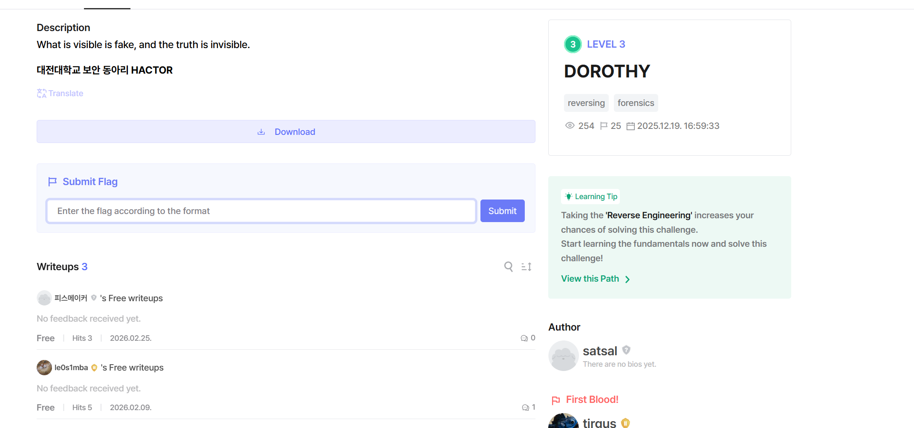

# Dorothy-dh-3

Bài này cho mình file apk thực ra nó là file zip mọi người giải nén ra sau đó mình tìm tòi 1 chut thì thấy trong string của classes3.dex có đoạn mã base64 ghi là key nên mình thử decode ra.

Key: You May Never Return

Lúc đầu mình tưởng đây là key để gairi nén file dorothy.png nhma khong phải sau đó mình tim thêm trong file apk đc giải nén thifthaasy thêm 1 file cũng là .png nhuwang mà thực chất là 7z nên mk đã dùng mật khẩu và giải nén nó

Sau khi giải nén thì mình nhận được file png mở nó lên 

1 ảnh thông thường ko có gì, tiếp là mk sẽ dùng 1 số công câu để khai thác kỹ thuật giấu tin, khi mình dùng zsteg thfi phát hiện 1điều 

Người tạ bảo câu trả lời đúng là ngày đầu tiên của bộ phịm này nên mình lên google tra thì phát hiện nó là 17-05-1900 nên mk đoán nó sẽ là pass cho file dorothy.png bạn đàu nham chỗ này mình sẽ thử ph biến thể của ngày tháng và pass chính xác là:19000517

sau khi giải nén mọi người sẽ nhận được 1 file là .txt và file flag.png, nhưng mà khi mà mk đọc flag trong file .png thfi nó sai đọc lại đề bài tác gải cso bảo vô hình mới là thật nên mình vào check file .txt thì thấy nó còn đoạn vô hình ở cuối có thể chính là dạng stegsnow nên mk decode và done.

DH{D0r0thy_w4nt5_t0_g0_h0m3}
