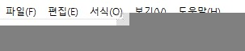
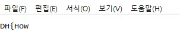

# Enc-jpg-dh

Bài này cho chúng ta 2 file 1 là file thực thi trên window file còn lại là data, mình sẽ chạy thử file thực thi trên window trước

Sau khi chạy mọi người sẽ thấy file data lúc trước đã thành file ảnh nên chúng ta sẽ khai thác file ảnh tiếp xem sao, 

Sau khi mở lên thì chẳng có gì mình mở bằng hxd kéo xuống cuối fiel thì thấy nó kết thức lại là file png nên mình đớn có vẻ file jpg đã được chèn thêm data, mình tìm kết thức file jpg sau đó cắt  ra xem thử.

Ở đây mọi người sẽ thấy cuối file jpg là ff d9, cta sẽ cắt từ đầu đến hết để lấy hết data của fiel jpg, bài  này sẽ có 2 data kết thúc file jpg mọi nguawowif ph xóa ff d9 đầu tiên đi

Có được phần đầu flag sau đó mọi người sẽ thấy ở ngay cuồi data chúng ta vừa lấy có các phần khác nhua cảu flag 

DH{How_ENc_ECrypt_yo}
