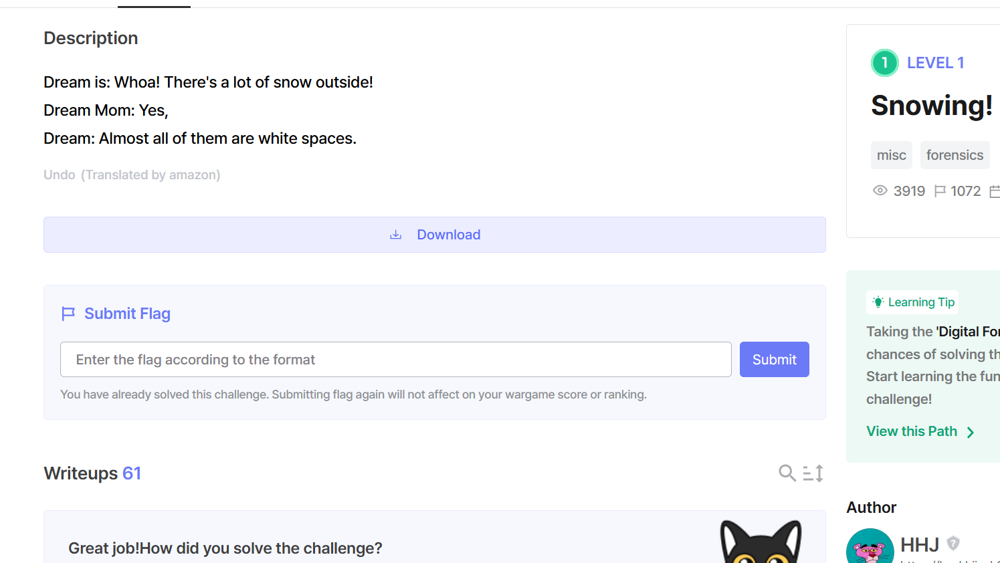

# Snowing-dreamhack

- Bài này sẽ cho chúng ta chúng ta 1 file flag.txt và 1 file ảnh, khi mà mở file flag lên thì mọi người sẽ thấy 1 cái flag fake và 1 khoảng trống toàn dấu cách và space nên mọi người có thể nghĩ ngay đến kiểu mã hóa stegsnow

 

- Mọi người tải stegsnow về và chạy thì se có được flag.

 

DH{w0w_1t_Sn0w5}
