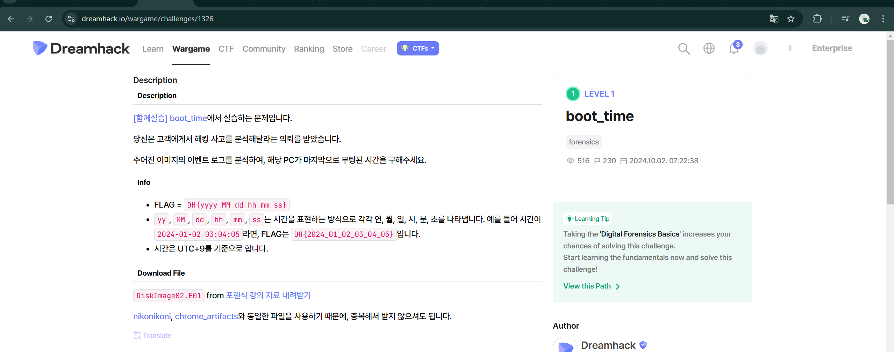

# boot_time-dh

`Wininit = Windows Initialization`

Event này xuất hiện khi tiến trình `wininit.exe` được gọi trong giai đoạn khởi tạo hệ thống đầu tiên sau `BIOS`, ngay trước khi người dùng có thể đăng nhập.

Nó xảy ra trước cả `Event ID 6005` và thường là dấu hiệu boot thực sự sớm nhất trong Windows.

DH{2024_04_07_00_23_44}

carped
