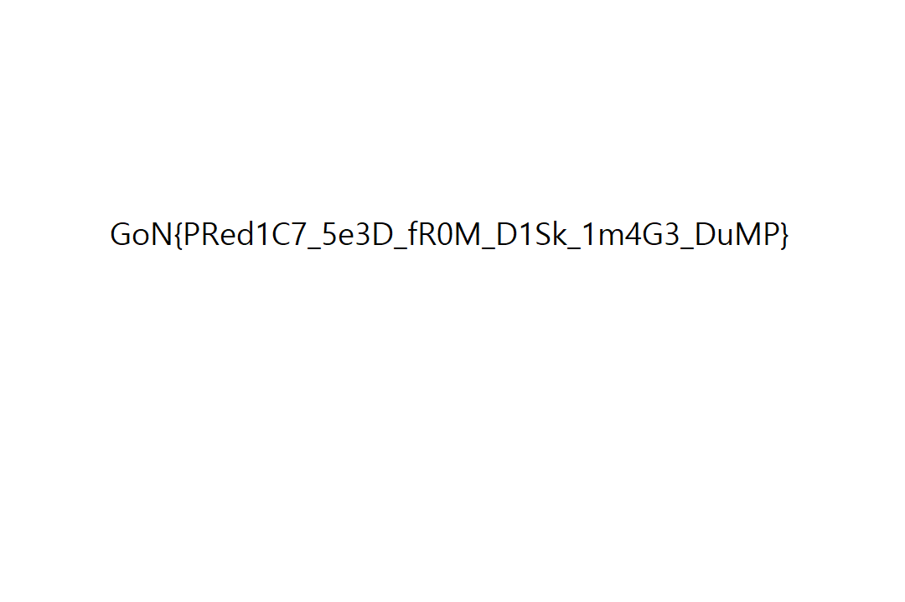

# farmar-dh


- `open(...,"rb")`: mở file ảnh PNG ở chế độ **binary**
- `data = f.read()`: đọc toàn bộ file vào RAM
- `filesize = len(data)`: lấy **số byte** của file
- Vòng `for i in range(...)`: tính số mảnh cần cắt theo **chunk 1000 byte**
    - `filesize // 1000` = số mảnh đủ 1000 byte
    - nếu còn dư (`filesize % 1000 != 0`) thì cộng thêm 1 mảnh cuối
- `frag = data[i*1000:(i+1)*1000]`: lấy mảnh thứ `i`
    - mảnh 0: bytes `0..999`
    - mảnh 1: bytes `1000..1999`
    - …
    - mảnh cuối: có thể < 1000 byte

Bài cung cấp cho chúng ta 1 file linux rev mình sẽ mở nó lên bằng autopsy\


Ở đây mọi người sẽ thấy có 1 file binary và 10 file ảnh mình sẽ extract toàn bộ

- File nhị phân đó là **chương trình mã hoá** các mảnh flag.png.xx.
- Nó nhận tối đa **1008 byte**, **pad PKCS#7 theo block 16**, rồi với **mỗi block 16 byte** nó chọn ngẫu nhiên 1 trong 3 phép biến đổi (XOR 16 byte random / hoán vị byte theo PRNG / hoán vị kiểu khác), và **lặp 64 vòng** → nhìn như “không thể giải mã”.
- Nhưng “ngẫu nhiên” của nó không thật: nó dùng **srand(time(NULL))** để seed PRNG. Vì time(NULL) là **Unix time theo giây**, nên nếu biết **thời điểm chương trình chạy** (lấy từ timestamp tạo file trong forensics), ta biết luôn seed.
- Khi seed đã biết, mọi rand() sinh ra **y hệt** → ta có thể chạy lại chương trình với seed đó để **tái tạo đúng key/XOR và permutation**, rồi suy ra **mapping** từ ciphertext → plaintext và khôi phục lại dữ liệu.
- Thứ quan trọng nhất là: nó **gọi srand(time(NULL))** (seed = timestamp), và nó dùng PRNG để tạo **XOR bytes + permutation**.
- Từ đó bạn chỉ cần **đúng timestamp/seed** cho từng flag.png.00..09 để dựng lại mapping và giải mã ra recovered.png (flag nằm trong ảnh).

```python
define myfunction
python
import gdb

def run_with_seed(seed):
    # Break at srand@plt for THIS run, then force srand(seed) by overwriting EDI
    gdb.execute("set breakpoint pending on")
    gdb.execute("tbreak srand@plt")
    gdb.execute("r < input > output")
    gdb.execute(f"set $edi = {seed}")
    gdb.execute("c")

def get_mapping(rdi_target):
    # 1) Find index permutation (idx <-> cidx) using crafted input
    data = [0 for _ in range(17*16)]
    for idx in range(16):
        data[16*(idx+1) + idx] = 1

    data = bytes(data)
    with open('input', 'wb') as f:
        f.write(data)

    run_with_seed(rdi_target)

    def find_unique_diff_element(R1, R2):
        assert len(R1) == len(R2) == 16
        i = None
        for k in range(16):
            if R1[k] != R2[k]:
                i = k
                break
        assert i is not None
        for j in range(16):
            if j == i:
                continue
            assert R1[j] == R2[j]
        return i

    with open('output', 'rb') as f:
        out = f.read()

    idx_2_cidx = {}
    cidx_2_idx = {}
    R = out[0:16]
    for idx in range(16):
        row = out[16*(idx+1):16*(idx+2)]
        cidx = find_unique_diff_element(R, row)
        idx_2_cidx[idx]  = cidx
        cidx_2_idx[cidx] = idx

    # 2) Build mapping[cidx][cipher_byte] = (idx, plain_byte)
    mapping = [[None for _ in range(256)] for _ in range(16)]

    def generate_data(low, high):
        buf = [0 for _ in range(60*16)]
        for row in range(high - low):
            for idx in range(16):
                buf[16*row + idx] = row + low
        buf = bytes(buf)
        with open('input', 'wb') as f:
            f.write(buf)

    def map_function(low, high):
        generate_data(low=low, high=high)
        run_with_seed(rdi_target)

        with open('output', 'rb') as f:
            out2 = f.read()

        for row in range(high - low):
            b = row + low
            for cidx in range(16):
                c = out2[16*row + cidx]
                mapping[cidx][c] = (cidx_2_idx[cidx], b)

    map_function(low=0,   high=60)
    map_function(low=60,  high=120)
    map_function(low=120, high=180)
    map_function(low=180, high=240)
    map_function(low=240, high=256)

    return mapping

mappings = []
targets = [
    1661114954, 1661114956, 1661114964, 1661114970, 1661114975,
    1661114982, 1661114992, 1661114995, 1661115002, 1661115005
]
for target in targets:
    mappings.append(get_mapping(rdi_target=target))

with open('mappings.py', 'w') as f:
    f.write(f'mappings = {mappings}')

print("[+] Wrote mappings.py successfully")
end
end

```


Sau khi chạy mọi người sẽ nhận được file [mapping.py](http://mapping.py) dùng nó để recover lại các file png là được

```python
from mappings import mappings

def recover(mapping, png_id):
    with open(f'flag.png.{png_id:02d}', 'rb') as f:
        data = f.read()

    assert len(data) % 16 == 0
    recovered = [0 for _ in range(len(data))]
    for row in range(len(data) // 16):
        R = data[16*row:16*(row+1)]
        arr = [None for _ in range(16)]
        for cidx, c in enumerate(R):
            idx, b = mapping[cidx][c]
            arr[idx] = b
        recovered[16*row:16*(row+1)] = arr
    return recovered

total_recovered = []
for png_id in range(10):
    mapping = mappings[png_id]
    recovered = recover(mapping=mapping, png_id=png_id)
    recovered = bytes(recovered)
    total_recovered.extend(recovered[:-8])

total_recovered = bytes(total_recovered)
with open('recovered.png', 'wb') as f:
    f.write(total_recovered)

```


