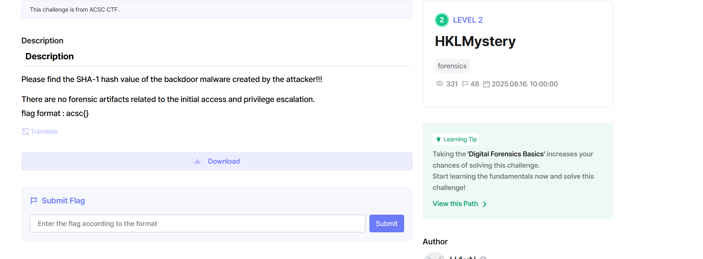

# hkl-mystery-dh



Bài này cho cta 1 thư mục local file nên mình sẽ mở nó trong autopsy, theo như bài thì việc của chúng ta là tìm malware nên mình sẽ ưu tiên tìm các file .exe, mọi người dùng chức năng tìm kiếm file trên autopsy là được 


sau đó mình sẽ dump file này ra và thử mở nó bằng ida xem sao


- Hàm main so sánh hash của b4ckd00r.exe với 1 mã hash đã được encrypt và obfuscation trong code
- Có 1 chuỗi base64 được chia làm 3 phần và sub_140001300 dùng để giải mã chúng
- 


Tiếp tục là 

### 1) Lắp ráp chuỗi Base64 bằng `memmove`

- Hàm tạo ra 1 `std::string` tạm từ `sub_140003050(a2, a3)` (đây là **mảnh 1 / 2** tùy implement).
- Sau đó lấy **mảnh từ `a4`** (data + length) và **append** vào cuối string đó.
- Nếu capacity đủ thì:
    - tăng size: `v6[2] = v10 + v9`
    - `memmove(dst, src, len)` copy mảnh vào cuối
    - thêm `'\0'`
- Nếu không đủ thì gọi `sub_140003420` để reallocate rồi append.

=> Kết quả là **chuỗi Base64 hoàn chỉnh** (được ghép từ nhiều mảnh).

---

### 2) Gọi `CryptStringToBinaryA(..., pbBinary=0, pcbBinary=...)` để “hỏi size”

`CryptStringToBinaryA(v14, 0, 1u, 0, pcbBinary, 0, 0)`:

- `1u` = cờ **CRYPT_STRING_BASE64** (decode Base64).
- Tham số thứ 4 (`pbBinary`) = `NULL` → **không decode**, chỉ **tính số byte output** cần thiết.
- API sẽ ghi số byte cần vào `pcbBinary[0]`.

=> Đây không phải “trick OS”, mà là **cách dùng chuẩn** của API WinCrypt: gọi 2 lần (lần 1 lấy size, lần 2 lấy data).

---

### 3) Cấp phát đúng size rồi decode thật

- `v20 = operator new(pcbBinary[0]);` (hoặc nhánh align nếu lớn)
- Gọi lại: `CryptStringToBinaryA(..., (BYTE*)v20, pcbBinary, ...)`
    - Lần này `pbBinary = v20` nên **decode thật** và ghi bytes vào vùng nhớ đó.

Dến đây mình sẽ dùng python decode

```python
import base64

part1 = "eKQexDO1Q2Uk/"
part2 = (0x644A4233766A6369).to_bytes(8, byteorder='little').decode('utf-8')
part3 = (0x3D41584F476967).to_bytes(8, byteorder='little').decode('utf-8').strip('\x00')

b64_string = part1 + part2 + part3
print(f"[*] Base64 String: {b64_string}")
hash_bytes = base64.b64decode(b64_string)

sha1_hash = hash_bytes.hex().upper()

print(f"[*] Payload SHA-1 Hash: {sha1_hash}")
```

Flag: ascs{78A41EC433B5436524FE2723BF70497608863970}
