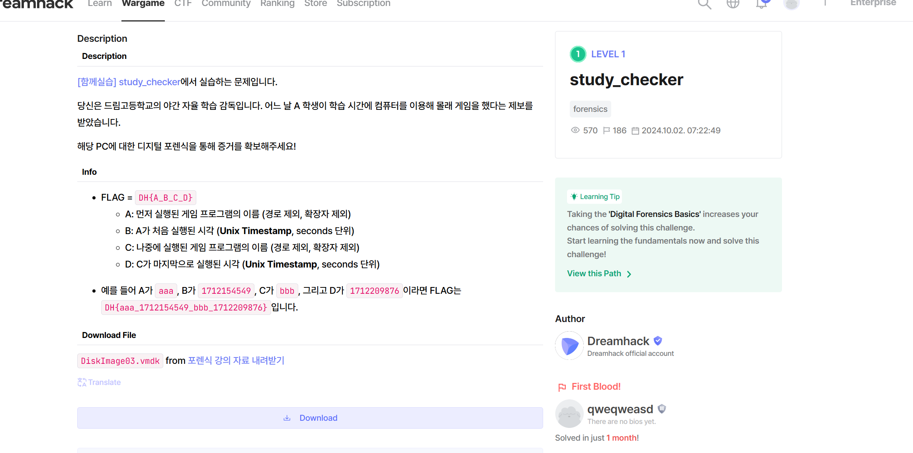

# study_checker-dh

Bài này cung cấp cho chúng ta 1 file vmdk mình sẽ chuyển sang raw để dùng autopsy , mọi người nhở tải qemy-img trước nhé

Sau đó mở lên bằng autopsy và đi đến thư mục prefetch trong windows vì đây là nơi lưu các chương trình đã chạy của window rất phù hợp với bài này

Ở đây mọi người sẽ nhìn thấy luôn được 2 game mà học sinh đã chơi nhưng mà để nhìn được thời gian sớm nhất và cuối mà học sinh đã chơi thì mọi người cần extract 2 file này ra sau đó chuyển sang .csv thì mới đọc được

Đến đây thì chúng ta đổi sang unix là được

Flag: DH{Minesweeper_1713712791_PINBALL_1713713644}
