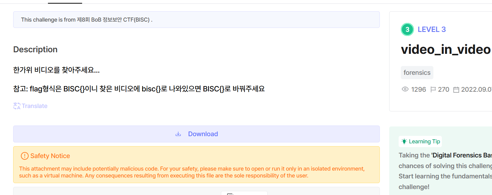

# video_in_video-dreamhack

- Chúng ta sẽ có một file ảnh nhưng mà không có gì hết nhìn lại đề bài là video_in_video nên mình sẽ tìm thử header file .mp4.

 

- Mọi người sẽ cop từ đoạn này đến hết để tạo 1 file .mp4 nhé.
- Khi mở file mp4 lên mk thấy chẳng có gì hết nên mình sẽ tiếp tục khai thác dữ liệu của nó đối với file video thì ae sẽ khai thác ở mdat đây là nơi lưu các dữ liệu thô và chỗ phù hợp để chèn dữ liệu.

  

- Để cắt phù hợp thì ae sẽ tính toán mình cần cắt đến đâu thì mỗi mdat sẽ có sẽ có 4 byte trước nó lưu dộ lớn của box mdat.
- Độ lớn của box `mdat` là: `00 0F E0 7A` = `1040506`

vậy chúng ta sẽ cắt từ offset ff9b đến hết.

- có được video tieps theo thì chúng sẽ mở nó bằng kmplayer là có được flag.

 

bisc{codec_based_carving}.
