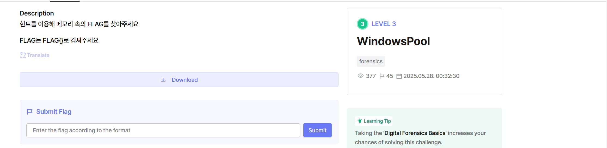

# windowpool-dh

- Bài cho 4 file trong đó có 1 file là memdmp của Win, mình sẽ mở hint của bài lên trước xem có gì không

- Driver kernel (quyền admin) **alloc NonPagedPool 0x300 bytes** với tag `'looP'` (little-endian đọc ra thành **"Pool"**) để dễ nhận diện trong dump RAM/pool.vmem.
- Nó **ghi magic 8 bytes** `0xDEADBEEFCAFEBABE` vào **đầu buffer** (trong RAM sẽ thấy byte: `BE BA FE CA EF BE AD DE`).
- Sau đó **dịch con trỏ +8 bytes** và `RtlCopyMemory` **copy chuỗi flag** (bị che `############`) vào ngay phía sau.

=> Cách làm: **scan NonPagedPool** tìm tag **Pool/looP** + magic `DEADBEEFCAFEBABE`, **flag nằm ngay sau 8 bytes đầu**.

Đến đây mọi người mở file vmem sau đó tìm hex : 

**Hex để search:** `BE BA FE CA EF BE AD DE` vì nó ở little endian

Flag: FLAG{po01_Al10cA7e_XD}
