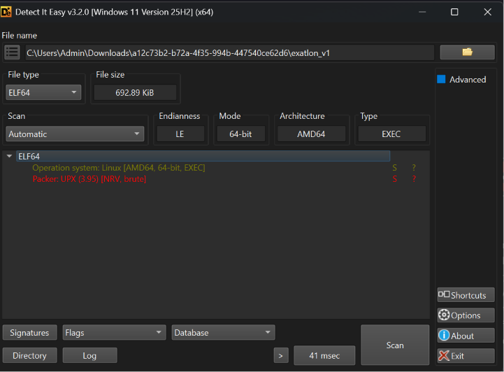

# Exatlon-rev-easy-htb



ở đây mình kiểm tra thấy nó đang được đóng gói bằng upx nên mình sẽ giải nén nó 

tiếp mình có chạy thử thì nó yêu cầu nhập password

```python
➜  a12c73b2-b72a-4f35-994b-447540ce62d6 ./exatlon_v1

███████╗██╗  ██╗ █████╗ ████████╗██╗      ██████╗ ███╗   ██╗       ██╗   ██╗ ██╗
██╔════╝╚██╗██╔╝██╔══██╗╚══██╔══╝██║     ██╔═══██╗████╗  ██║       ██║   ██║███║
█████╗   ╚███╔╝ ███████║   ██║   ██║     ██║   ██║██╔██╗ ██║       ██║   ██║╚██║
██╔══╝   ██╔██╗ ██╔══██║   ██║   ██║     ██║   ██║██║╚██╗██║       ╚██╗ ██╔╝ ██║
███████╗██╔╝ ██╗██║  ██║   ██║   ███████╗╚██████╔╝██║ ╚████║███████╗╚████╔╝  ██║
╚══════╝╚═╝  ╚═╝╚═╝  ╚═╝   ╚═╝   ╚══════╝ ╚═════╝ ╚═╝  ╚═══╝╚══════╝ ╚═══╝   ╚═╝

[+] Enter Exatlon Password  : 123
[-] ;(

███████╗██╗  ██╗ █████╗ ████████╗██╗      ██████╗ ███╗   ██╗       ██╗   ██╗ ██╗
██╔════╝╚██╗██╔╝██╔══██╗╚══██╔══╝██║     ██╔═══██╗████╗  ██║       ██║   ██║███║
█████╗   ╚███╔╝ ███████║   ██║   ██║     ██║   ██║██╔██╗ ██║       ██║   ██║╚██║
██╔══╝   ██╔██╗ ██╔══██║   ██║   ██║     ██║   ██║██║╚██╗██║       ╚██╗ ██╔╝ ██║
███████╗██╔╝ ██╗██║  ██║   ██║   ███████╗╚██████╔╝██║ ╚████║███████╗╚████╔╝  ██║
╚══════╝╚═╝  ╚═╝╚═╝  ╚═╝   ╚═╝   ╚══════╝ ╚═════╝ ╚═╝  ╚═══╝╚══════╝ ╚═══╝   ╚═╝

[+] Enter Exatlon Password  :
```

giờ mình mở nó lên bằng ida 

```python
.text:0000000000404C37 loc_404C37:
.text:0000000000404C37 lea     rsi, unk_54B00F
.text:0000000000404C3E lea     rdi, _ZSt4cout  ; std::ostream *
.text:0000000000404C45 call    _ZStlsISt11char_traitsIcEERSt13basic_ostreamIcT_ES5_PKc ; std::operator<<<std::char_traits<char>>(std::ostream &,char const*)
.text:0000000000404C4A lea     rsi, unk_54B018
.text:0000000000404C51 lea     rdi, _ZSt4cout  ; std::ostream *
.text:0000000000404C58 call    _ZStlsISt11char_traitsIcEERSt13basic_ostreamIcT_ES5_PKc ; std::operator<<<std::char_traits<char>>(std::ostream &,char const*)
.text:0000000000404C5D lea     rsi, unk_54B0D8
.text:0000000000404C64 lea     rdi, _ZSt4cout  ; std::ostream *
.text:0000000000404C6B call    _ZStlsISt11char_traitsIcEERSt13basic_ostreamIcT_ES5_PKc ; std::operator<<<std::char_traits<char>>(std::ostream &,char const*)
.text:0000000000404C70 mov     edi, 1
.text:0000000000404C75 call    sleep
.text:0000000000404C7A lea     rsi, unk_54B1A8
.text:0000000000404C81 lea     rdi, _ZSt4cout  ; std::ostream *
.text:0000000000404C88 call    _ZStlsISt11char_traitsIcEERSt13basic_ostreamIcT_ES5_PKc ; std::operator<<<std::char_traits<char>>(std::ostream &,char const*)
.text:0000000000404C8D lea     rsi, unk_54B260
.text:0000000000404C94 lea     rdi, _ZSt4cout  ; std::ostream *
.text:0000000000404C9B call    _ZStlsISt11char_traitsIcEERSt13basic_ostreamIcT_ES5_PKc ; std::operator<<<std::char_traits<char>>(std::ostream &,char const*)
.text:0000000000404CA0 mov     edi, 1
.text:0000000000404CA5 call    sleep
.text:0000000000404CAA lea     rsi, unk_54B320
.text:0000000000404CB1 lea     rdi, _ZSt4cout  ; std::ostream *
.text:0000000000404CB8 call    _ZStlsISt11char_traitsIcEERSt13basic_ostreamIcT_ES5_PKc ; std::operator<<<std::char_traits<char>>(std::ostream &,char const*)
.text:0000000000404CBD mov     edi, 1
.text:0000000000404CC2 call    sleep
.text:0000000000404CC7 lea     rsi, unk_54B400
.text:0000000000404CCE lea     rdi, _ZSt4cout  ; std::ostream *
.text:0000000000404CD5 call    _ZStlsISt11char_traitsIcEERSt13basic_ostreamIcT_ES5_PKc ; std::operator<<<std::char_traits<char>>(std::ostream &,char const*)
.text:0000000000404CDA mov     edi, 1
.text:0000000000404CDF call    sleep
.text:0000000000404CE4 lea     rax, [rbp+var_50]
.text:0000000000404CE8 mov     rdi, rax
.text:0000000000404CEB call    _ZNSt7__cxx1112basic_stringIcSt11char_traitsIcESaIcEEC2Ev ; std::string::basic_string(void)
.text:0000000000404CF0 lea     rsi, aEnterExatlonPa ; "[+] Enter Exatlon Password  : "
.text:0000000000404CF7 lea     rdi, _ZSt4cout  ; std::ostream *
.text:0000000000404CFE ;   try {
.text:0000000000404CFE call    _ZStlsISt11char_traitsIcEERSt13basic_ostreamIcT_ES5_PKc ; std::operator<<<std::char_traits<char>>(std::ostream &,char const*)
.text:0000000000404D03 lea     rax, [rbp+var_50]
.text:0000000000404D07 mov     rsi, rax
.text:0000000000404D0A lea     rdi, _ZSt3cin   ; std::cin
.text:0000000000404D11 call    _ZStrsIcSt11char_traitsIcESaIcEERSt13basic_istreamIT_T0_ES7_RNSt7__cxx1112basic_stringIS4_S5_T1_EE ; std::operator>><char>(std::istream &,std::string &)
.text:0000000000404D16 lea     rax, [rbp+var_30]
.text:0000000000404D1A lea     rdx, [rbp+var_50]
.text:0000000000404D1E mov     rsi, rdx
.text:0000000000404D21 mov     rdi, rax
.text:0000000000404D24 call    _Z7exatlonRKNSt7__cxx1112basic_stringIcSt11char_traitsIcESaIcEEE ; exatlon(std::string const&)
.text:0000000000404D29 lea     rax, [rbp+var_30]
.text:0000000000404D2D lea     rsi, a11521344105619 ; "1152 1344 1056 1968 1728 816 1648 784 1"...
.text:0000000000404D34 mov     rdi, rax
.text:0000000000404D37 call    _ZSteqIcSt11char_traitsIcESaIcEEbRKNSt7__cxx1112basic_stringIT_T0_T1_EEPKS5_ ; std::operator==<char>(std::string const&,char const*)
.text:0000000000404D3C mov     ebx, eax
.text:0000000000404D3E lea     rax, [rbp+var_30]
.text:0000000000404D42 mov     rdi, rax
.text:0000000000404D45 call    _ZNSt7__cxx1112basic_stringIcSt11char_traitsIcESaIcEED2Ev ; std::string::~string()
.text:0000000000404D4A test    bl, bl
.text:0000000000404D4C jz      short loc_404D83
```

code này cho thấy dữ liệu đầu vào của chúng ta sẽ được gọi qua hàm exatlon cùng với chuỗi "1152 1344 1056 1968 1728 816 1648 784 1"... giờ việc của chúng ta là giải mã cái cuỗi này 

mình sẽ đặt 1 breakpoint ngay sau hàm exatlon để xem dữ liệu đầu vào được xử lí như thế nào

```python
gdb-peda$ b *0x404D29
Breakpoint 1 at 0x404d29
```

```python
gdb-peda$ r
Starting program: /mnt/c/Users/Admin/Downloads/a12c73b2-b72a-4f35-994b-447540ce62d6/exatlon_v1_unpacked

███████╗██╗  ██╗ █████╗ ████████╗██╗      ██████╗ ███╗   ██╗       ██╗   ██╗ ██╗
██╔════╝╚██╗██╔╝██╔══██╗╚══██╔══╝██║     ██╔═══██╗████╗  ██║       ██║   ██║███║
█████╗   ╚███╔╝ ███████║   ██║   ██║     ██║   ██║██╔██╗ ██║       ██║   ██║╚██║
██╔══╝   ██╔██╗ ██╔══██║   ██║   ██║     ██║   ██║██║╚██╗██║       ╚██╗ ██╔╝ ██║
███████╗██╔╝ ██╗██║  ██║   ██║   ███████╗╚██████╔╝██║ ╚████║███████╗╚████╔╝  ██║
╚══════╝╚═╝  ╚═╝╚═╝  ╚═╝   ╚═╝   ╚══════╝ ╚═════╝ ╚═╝  ╚═══╝╚══════╝ ╚═══╝   ╚═╝

[+] Enter Exatlon Password  : ABC
[----------------------------------registers-----------------------------------]
RAX: 0x7fffffffd9c0 --> 0x7fffffffd9d0 ("1040 1056 1072 ")
RBX: 0x400548 --> 0x0
RCX: 0x20323730 ('072 ')
RDX: 0x7fffffffd918 --> 0x7fffffffd9b3 --> 0x49ebc40000000000
RSI: 0x7fffffffd918 --> 0x7fffffffd9b3 --> 0x49ebc40000000000
RDI: 0x7fffffffd918 --> 0x7fffffffd9b3 --> 0x49ebc40000000000
RBP: 0x7fffffffd9f0 --> 0x49eb50 (<__libc_csu_init>:    push   r15)
RSP: 0x7fffffffd9a0 --> 0x7fffffffd9b0 --> 0x434241 (<_ZNKSt7__cxx119money_putIwSt19ostreambuf_iteratorIwSt11char_traitsIwEEE9_M_insertILb1EEES4_S4_RSt8ios_basewRKNS_12basic_stringIwS3_SaIwEEE+1249>: test   BYTE PTR [rcx+rcx*4-0x11],0xe8)
RIP: 0x404d29 (<main+253>:      lea    rax,[rbp-0x30])
R8 : 0x7fffffffd960 --> 0x2032373000 ('')
R9 : 0xa ('\n')
R10: 0x7fffffffd5c4 --> 0xc8f5d0032373031
R11: 0x0
R12: 0x49ebe0 (<__libc_csu_fini>:       push   rbp)
R13: 0x0
R14: 0x5a8018 --> 0x4d6f10 (<__rawmemchr_avx2>: mov    ecx,edi)
R15: 0x0
EFLAGS: 0x206 (carry PARITY adjust zero sign trap INTERRUPT direction overflow)
[-------------------------------------code-------------------------------------]
   0x404d1e <main+242>: mov    rsi,rdx
   0x404d21 <main+245>: mov    rdi,rax
   0x404d24 <main+248>: call   0x404aad <_Z7exatlonRKNSt7__cxx1112basic_stringIcSt11char_traitsIcESaIcEEE>
=> 0x404d29 <main+253>: lea    rax,[rbp-0x30]
   0x404d2d <main+257>: lea    rsi,[rip+0x1467bc]        # 0x54b4f0
   0x404d34 <main+264>: mov    rdi,rax
   0x404d37 <main+267>: call   0x4050fa <_ZSteqIcSt11char_traitsIcESaIcEEbRKNSt7__cxx1112basic_stringIT_T0_T1_EEPKS5_>
   0x404d3c <main+272>: mov    ebx,eax
[------------------------------------stack-------------------------------------]
0000| 0x7fffffffd9a0 --> 0x7fffffffd9b0 --> 0x434241 (<_ZNKSt7__cxx119money_putIwSt19ostreambuf_iteratorIwSt11char_traitsIwEEE9_M_insertILb1EEES4_S4_RSt8ios_basewRKNS_12basic_stringIwS3_SaIwEEE+1249>:        test   BYTE PTR [rcx+rcx*4-0x11],0xe8)
0008| 0x7fffffffd9a8 --> 0x3
0016| 0x7fffffffd9b0 --> 0x434241 (<_ZNKSt7__cxx119money_putIwSt19ostreambuf_iteratorIwSt11char_traitsIwEEE9_M_insertILb1EEES4_S4_RSt8ios_basewRKNS_12basic_stringIwS3_SaIwEEE+1249>:   test   BYTE PTR [rcx+rcx*4-0x11],0xe8)
0024| 0x7fffffffd9b8 --> 0x49ebc4 (<__libc_csu_init+116>:       add    rbx,0x1)
0032| 0x7fffffffd9c0 --> 0x7fffffffd9d0 ("1040 1056 1072 ")
0040| 0x7fffffffd9c8 --> 0xf
0048| 0x7fffffffd9d0 ("1040 1056 1072 ")
0056| 0x7fffffffd9d8 --> 0x20323730312036 ('6 1072 ')
[------------------------------------------------------------------------------]
Legend: code, data, rodata, value

Breakpoint 1, 0x0000000000404d29 in main ()
gdb-peda$
```

ở đây sau khi mình nhập ABC  thì nó đã được chuyển về thành "1040 1056 1072 "

‘A’→65→65*16→1040

….

giờ mình sẽ viets code để ra flag 

```python
#include<bits/stdc++.h>
using namespace std;
int main(){
	string s="";
	int a[36]={1152,1344,1056,1968,1728,816,1648,784,1584,816,1728,1520,1840,1664,784,1632,1856,1520,1728,816,1632,1856,1520,784,1760,1840,1824,816,1584,1856,784,1776,1760,528,528,2000};
	for(int i=0;i<36;i++){
		a[i]/=16;
		s+=a[i];
	}
	cout<<s;
}
```


