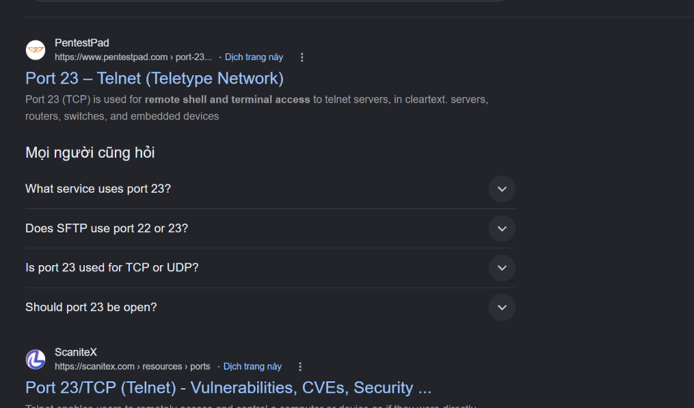

# Meow

Đây là 1 machine khá dễ dành cho những người mới như mình có thể tiếp cận với phần lớn các câu hỏi đọc là chúng ta sẽ có câu trả lời

`Task 1`

`In cybersecurity, isolated environments—like Pwnbox or the vulnerable target machines—are often VMs. What does VM stand for?`

`Đáp án: Virtual Machine`

`Task 2`

`What tool do we use to interact with the operating system in order to issue commands via the command line, such as the one to start our VPN connection? It's also known as a console or shell.`

`Đáp án: terminal`

`Task 3`

`What service do we use to form our VPN connection into HTB labs?`

`Đáp án: openvpn`

`Task 4`

`What tool do we use to test our connection to the target with an ICMP echo request?`

`Đáp án: ping`

`Task 5`

`What is the name of the most common tool for finding open ports on a target?`

`Đáp án: nmap`

`Task 6`

`What service do we identify on port 23/tcp during our scans?`

Đối với 5 câu trước thì khá là dễ chúng ta đọc là có được đáp án luôn đến câu này thì mình không nhớ port 23 là của service nào nữa nên phải tim kiếm qua google 



Rất dễ mình cũng đã có câu trả lời 

`Đáp án: Telnet`

`Task 7`

`What username is able to log into the target over telnet with a blank password?`

Tiếp câu này mình cũng không biết nên lại đi mò


ở đây thì mình có đọc thấy là nên thử các username như admin, administrator, root, user, or test nên sau đó mình có thử là lấy được username đúng

`Đáp án: root`

`Submit Single Flag
Submit the flag located in root's home directory.`

Tiếp câu cuối cùng là mình sẽ cần phải thông quá pwnbox và tiến hành lấy flag trong thư mục `root`

Đầu tiên thì mình sẽ cần kết nối vpn

```python
➜  Downloads sudo openvpn "starting_points_us-starting-point-2-dhcp (1).ovpn"
2026-10-09 23:00:57 DEPRECATED OPTION: --persist-key option ignored. Keys are now always persisted across restarts.
2026-10-09 23:00:57 WARNING: Compression for receiving enabled. Compression has been used in the past to break encryption. Compression support is deprecated and we recommend to disable it completely.
2026-10-09 23:00:57 Note: --data-ciphers-fallback with cipher 'AES-128-CBC' disables data channel offload.
2026-10-09 23:00:57 OpenVPN 2.7.5 x86_64-pc-linux-gnu [SSL (OpenSSL)] [LZO] [LZ4] [EPOLL] [PKCS11] [MH/PKTINFO] [AEAD] [DCO]
2026-10-09 23:00:57 library versions: OpenSSL 3.5.5 27 Jan 2026, LZO 2.10
2026-10-09 23:00:57 DCO version: N/A
2026-10-09 23:00:57 TCP/UDP: Preserving recently used remote address: [AF_INET]38.46.224.105:1337
2026-10-09 23:00:57 Socket Buffers: R=[212992->212992] S=[212992->212992]
2026-10-09 23:00:57 UDPv4 link local: (not bound)
2026-10-09 23:00:57 UDPv4 link remote: [AF_INET]38.46.224.105:1337
2026-10-09 23:00:57 TLS: Initial packet from [AF_INET]38.46.224.105:1337, sid=1d26c5f1 7b51f045
2026-10-09 23:00:57 VERIFY OK: depth=2, C=GR, O=Hack The Box, OU=Systems, CN=HTB VPN: Root Certificate Authority
2026-10-09 23:00:57 VERIFY OK: depth=1, C=GR, O=Hack The Box, OU=Systems, CN=HTB VPN: us-starting-point-2-dhcp Issuing CA
2026-10-09 23:00:57 VERIFY KU OK
2026-10-09 23:00:57 Validating certificate extended key usage
2026-10-09 23:00:57 ++ Certificate has EKU (str) TLS Web Client Authentication, expects TLS Web Server Authentication
2026-10-09 23:00:57 ++ Certificate has EKU (oid) 1.3.6.1.5.5.7.3.2, expects TLS Web Server Authentication
2026-10-09 23:00:57 ++ Certificate has EKU (str) TLS Web Server Authentication, expects TLS Web Server Authentication
2026-10-09 23:00:57 VERIFY EKU OK
```

Sau khi xong thì mình sẽ thử ping để kiểm tra 

```python
➜  ~ ping -c 4 10.129.50.45
PING 10.129.50.45 (10.129.50.45) 56(84) bytes of data.
64 bytes from 10.129.50.45: icmp_seq=1 ttl=63 time=251 ms
64 bytes from 10.129.50.45: icmp_seq=2 ttl=63 time=251 ms
64 bytes from 10.129.50.45: icmp_seq=3 ttl=63 time=251 ms
64 bytes from 10.129.50.45: icmp_seq=4 ttl=63 time=252 ms

--- 10.129.50.45 ping statistics ---
4 packets transmitted, 4 received, 0% packet loss, time 3004ms
rtt min/avg/max/mdev = 250.899/251.366/252.357/0.591 ms
➜  ~
```

Ok rồi giờ tiến hành làm bài thôi

Đầu tiên thì mình sẽ dùng nmap để recon/enumaration

```python
➜  ~ nmap -sV -Pn 10.129.50.45
Starting Nmap 7.98 ( https://nmap.org ) at 2026-10-09 23:14 +0700
Nmap scan report for 10.129.50.45
Host is up (0.26s latency).
Not shown: 999 closed tcp ports (reset)
PORT   STATE SERVICE VERSION
23/tcp open  telnet  Linux telnetd
Service Info: OS: Linux; CPE: cpe:/o:linux:linux_kernel

Service detection performed. Please report any incorrect results at https://nmap.org/submit/ .
Nmap done: 1 IP address (1 host up) scanned in 15.83 seconds
➜  ~
```

Sau khi quét ta phát hiện có 1 dịch vụ telnet đang chạy ở port 23. Đối với telnet thì chúng ta có thể thử kết nối và đăng nhập bằng 1 số tài khoản mà không cần pass như trên mình có đề cập 

```python
Meow login: root
Welcome to Ubuntu 20.04.2 LTS (GNU/Linux 5.4.0-77-generic x86_64)

 * Documentation:  https://help.ubuntu.com
 * Management:     https://landscape.canonical.com
 * Support:        https://ubuntu.com/advantage

  System information as of Fri 09 Oct 2026 04:18:36 PM UTC

  System load:           0.1
  Usage of /:            41.7% of 7.75GB
  Memory usage:          4%
  Swap usage:            0%
  Processes:             135
  Users logged in:       0
  IPv4 address for eth0: 10.129.50.45
  IPv6 address for eth0: dead:beef::a0de:adff:fe4a:8f1

 * Super-optimized for small spaces - read how we shrank the memory
   footprint of MicroK8s to make it the smallest full K8s around.

   https://ubuntu.com/blog/microk8s-memory-optimisation

75 updates can be applied immediately.
31 of these updates are standard security updates.
To see these additional updates run: apt list --upgradable

The list of available updates is more than a week old.
To check for new updates run: sudo apt update
Ubuntu comes with ABSOLUTELY NO WARRANTY, to the extent permitted by
applicable law.

Last login: Mon Sep  6 15:15:23 UTC 2021 from 10.10.14.18 on pts/0
root@Meow:~#
```

Ở đây sau 1 vài lần thử mình đã đăng nhập thành công bằng tài khoản root

```python
root@Meow:~# whoami
root
root@Meow:~# ls /
bin   cdrom  etc   lib    lib64   lost+found  mnt  proc  run   snap  sys  usr
boot  dev    home  lib32  libx32  media       opt  root  sbin  srv   tmp  var
root@Meow:~# ls -la
total 36
drwx------  5 root root 4096 Jun 18  2021 .
drwxr-xr-x 20 root root 4096 Jul  7  2021 ..
lrwxrwxrwx  1 root root    9 Jun  4  2021 .bash_history -> /dev/null
-rw-r--r--  1 root root 3132 Oct  6  2020 .bashrc
drwx------  2 root root 4096 Apr 21  2021 .cache
-rw-r--r--  1 root root   33 Jun 17  2021 flag.txt
drwxr-xr-x  3 root root 4096 Apr 21  2021 .local
-rw-r--r--  1 root root  161 Dec  5  2019 .profile
-rw-r--r--  1 root root   75 Mar 26  2021 .selected_editor
drwxr-xr-x  3 root root 4096 Apr 21  2021 snap
root@Meow:~# cat flag.txt
b40abdfe23665f766f9c61ecba8a4c19
root@Meow:~#
```

Sau khi vào thì mình thấy người dùng root có thể đọc flag.txt nên mình đã có thể lấy được flag luôn 

`Đáp án: b40abdfe23665f766f9c61ecba8a4c19`