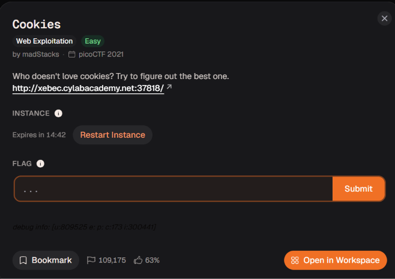

# Cookies

Trạng thái: Chưa bắt đầu
Trạng thái 1: Chưa bắt đầu



Tiếp tục với 1 bài nữa chúng ta thấy ngay đề bài cố liên quan đến cookie


Đầu tiên vào thì giao diện cho mình 1 ô nhập cookies để search sau đó là trả về thông báo cookies sai 


Trong burp thì mình thấy ở gói tin phản hồi có 1 đoạn mã cookie mình decode ra thử 

```python
➜  ctf echo "eyJfZmxhc2hlcyI6W3siIHQiOlsiZGFuZ2VyIiwiVGhhdCBkb2Vzbid0IGFwcGVhciB0byBiZSBhIHZhbGlkIGNvb2tpZS4iXX1dfQ.asJVEQ.dr8K9ZVziBFBRel0HevqRyhFJFk" | base64 -d
{"_flashes":[{" t":["danger","That doesn't appear to be a valid cookie."]}]}
```

Đây chính là thông báo lỗi mà chúng ta nhận được khi tiềm kiếm bằng search, đến đây mình đã mắc lỗi bằng việc cứ ngồi thử thay đổi cookie nhưng mà tất cả đều trả về 302 FOUND và cookies thông báo lỗi lặp lại, sau khi tìm hiểu mình thấy nó đều điều hướng gói post này về trang chủ nên mình đoán `POST /search` chỉ là trạm trung gian để gán cookie. Luồng xử lý logic tiếp theo bắt buộc phải nằm ở gói tin `GET /`


Khi phân tích gói tin `GET /` , mình nhận thấy server không trả về trang web ngay lập tức mà phản hồi mã `302 FOUND`. Đặc biệt, trong phần Response, máy chủ đã chủ động gửi kèm header `Set-Cookie: name=-1` cùng với lệnh điều hướng `Location: /`.   
Bằng chứng này càng khẳng định vững chắc lập luận của mình: endpoint trang chủ (`/`) chính là nơi đảm nhận logic xử lý và kiểm tra cookie. Khi phát hiện một request không có cookie hoặc cookie không hợp lệ, đoạn code kiểm tra tại `/` sẽ lập tức can thiệp, khởi tạo/ép giá trị cookie về mặc định là `-1` và buộc trình duyệt chuyển hướng để làm mới trạng thái.


Sau đó mình sẽ vào gói tin sau khi được điều hướng và thử điều chỉnh cookie về 1 số khác và nó redirect mình đến /check


Tiếp mình sẽ truy cập đến /check  và thấy trong gói tin phả hồi là 1 cookie nhưng không phải cookie đặc biệt nên mình đoán ở 1 số nào đó thì chúng ta sẽ có được flag trong gói tin trả về nếu trong cookie ta đoán được số đó vậy nên mình gửi qua intruder và tiến hành brutce force 


Bôi đen đúng con số `1` (trong `name=1`), rồi bấm **Add §**.
Sang tab **Payloads**.
Tại ô *Payload type*, xổ xuống chọn **Numbers**.
Ở bảng cài đặt bên dưới, điền lần lượt: **From:** `1`, **To:** `50`, **Step:** `1`.
Bấm nút **Start attack** ở góc trên.


Với name=18 chúng ta sẽ có được flag 

academy{3v3ry1_l0v3s_c00k135_90a3a7cb}