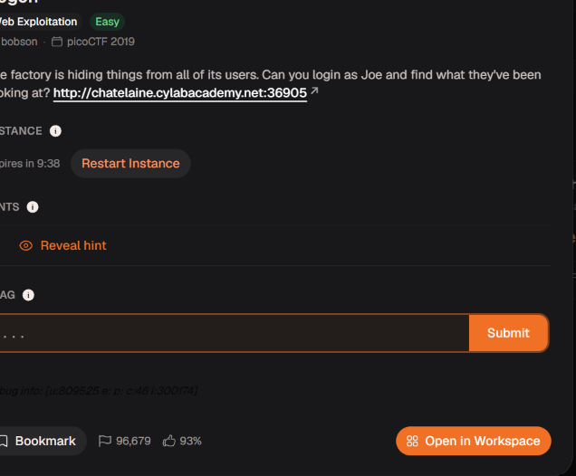

# Logon

Đây là 1 bài web yêu cầu mình tìm cái gì đó đang được ẩn giấu bằng cách đăng nhập 

Ở đây đầu tiên mình nhập đại 1 username và pass vào xem thế nào

Sau khi đăng nhập thì mình  thấy được đưa đến /flag không thấy có gì cả 

Đầu tiên với gói tin POST /login thì mình thấy trong gói response ở phần header có thêm 3 trường cookie tương ứng với username và password mà chúng ta nhập, ngoài ra còn 1 trường admin rất khả nghi

Tiếp vì trong gói tin POST /login vừa này chúng ta thấy nó được redirect thằng đến trang /flag này và kèm theo 3 cookie vừa được cấp, ở đây mình đoán là server sẽ dựa vào trường cookie admin xem chúng ta có quyền đọc được nội dung ẩn hay không. Mình tự hỏi liệu sẽ ra sao nếu chúng ta sửa admin=False thành admin=True.

Đây là kết quả sau khi mình sửa trường admin thành True, chúng ta đã có được flag

academy{th3_c0nsp1r4cy_l1v3s_0e363b57}