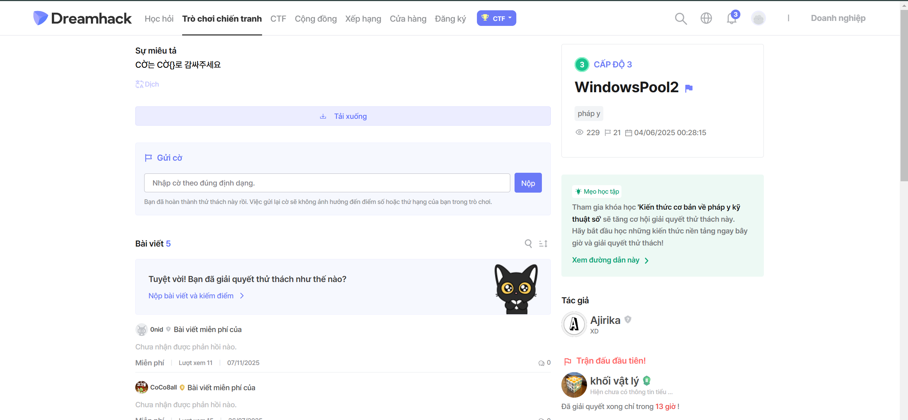

# windowpool2-dh-3

Bài cho chúng ta 1 file vmem và 1 file source.cpp, đọc file code mọi người sẽ thấy flag dài 16 byte và nó dùng 
driver **cấp phát pool 256 bytes** với **tag `corP`**

Đến đay mình sẽ dùng drivescan cho file vmem để xem có gì và mình bắt gặp 1 dirver testpool khá lạ và trông có liên kết đến đè bài windowpool nên mình sẽ dump nó ra

Sau khi dump xong về mình sẽ cho nó lên ida để dịch ngược sau khi đưa lên ida thì mình phát hiện có 1 đanọ so sánh với độ dìa 16 byte rất giống với dộ dài flag bài cho nên mình đã check và done

